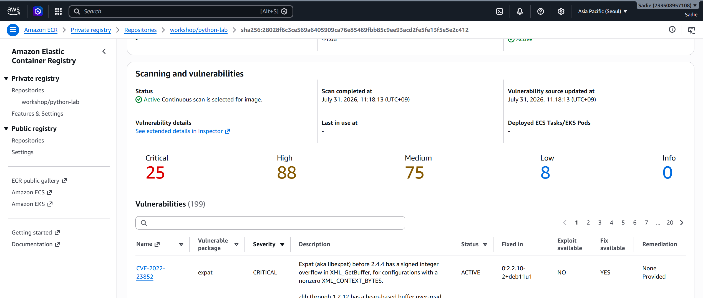
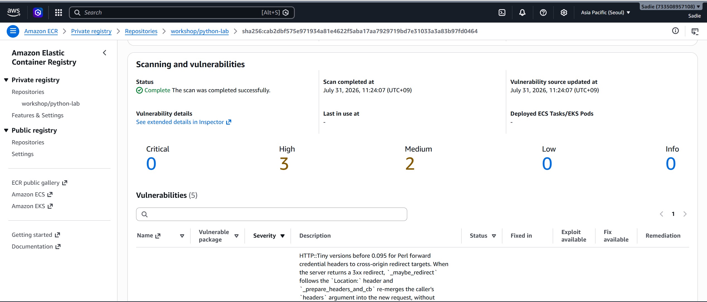

# AWS 기반 컨테이너 이미지 취약점 개선 실습

이번 실습에서는 AWS ECR과 Amazon Inspector를 이용하여 오래된 Python 이미지를 스캔하고, 최신 베이스 이미지로 변경했을 때 취약점이 얼마나 감소하는지 확인해 보았다.

## 실습 환경

- AWS CloudShell
- Amazon ECR (Private Repository)
- Amazon Inspector (Enhanced scanning)
- crane CLI (컨테이너 이미지 복사 도구, Docker 불필요)

## 사용 이미지

| 구분 | 이미지 |
|---|---|
| Before (취약) | python:3.6-slim |
| After (개선) | python:3.12-slim |

## 실습 과정

먼저 CloudShell에서 사용할 리전과 계정 정보를 변수로 설정했다.

이후 ECR Private Repository(`workshop/python-lab`)를 생성하고, Amazon Inspector의 Enhanced Scanning을 활성화했다. 처음에는 ECR 기본 스캔만 있는 줄 알았는데, 기본 스캔은 OS 패키지만 보고 Enhanced scanning(Inspector)은 npm/pip 같은 언어 패키지 의존성까지 잡아준다는 걸 알게 되어 Enhanced로 진행했다.

Docker를 설치하지 않아도 이미지를 바로 복사할 수 있는 `crane`이라는 CLI 도구를 이용해서 이미지를 복사했다. Docker를 설치하지 않아도 이미지를 바로 복사할 수 있는 crane이라는 CLI 도구를 이용해서 이미지를 복사했다. 별도의 Docker 환경을 만들지 않아도 되어 CloudShell에서 실습하기 편했다.

```bash
export REGION=ap-northeast-2
export ACCOUNT_ID=$(aws sts get-caller-identity --query Account --output text)
export ECR=$ACCOUNT_ID.dkr.ecr.$REGION.amazonaws.com

aws ecr create-repository --repository-name workshop/python-lab --region $REGION
aws inspector2 enable --resource-types ECR --region $REGION

aws ecr get-login-password --region $REGION | crane auth login --username AWS --password-stdin $ECR

crane copy --platform linux/amd64 \
  public.ecr.aws/docker/library/python:3.6-slim \
  $ECR/workshop/python-lab:before

crane copy --platform linux/amd64 \
  public.ecr.aws/docker/library/python:3.12-slim \
  $ECR/workshop/python-lab:after
```

참고로 처음에 `--platform` 옵션 없이 그냥 복사했더니 멀티 아키텍처 이미지(Image Index)가 통째로 올라가서 Inspector가 "UnsupportedImageError"를 띄우며 스캔을 못 했다. amd64 하나만 지정해서 다시 올리니 정상적으로 스캔됐다.

## 결과 비교

| 구분 | Critical | High |
|---|---|---|
| Before (3.6-slim) | 25 | 88 |
| After (3.12-slim) | 0 | 3 |

오래된 Python 3.6 이미지는 Critical과 High 취약점이 많이 발견되었다. 최신 Python 3.12 이미지로 변경한 뒤에는 Critical 취약점이 모두 사라지고 High도 크게 감소하는 것을 확인하였다. 베이스 이미지만 바꿨는데도 취약점 개수가 크게 줄어드는 것이 생각보다 신기했다.

### Before 스캔 결과


### After 스캔 결과


## 정리

실습 종료 후에는 불필요한 AWS 비용이 발생하지 않도록 생성했던 ECR Repository와 Inspector 설정을 삭제하고, crane도 제거하였다.

```bash
aws inspector2 disable --resource-types ECR --region $REGION
aws ecr delete-repository --repository-name workshop/python-lab --force --region $REGION
sudo rm -f /usr/local/bin/crane
```

## 실습하면서 느낀 점

이번 실습에서는 애플리케이션 코드를 변경하지 않고도 베이스 이미지만 최신 버전으로 바꾸는 것만으로 취약점을 크게 줄일 수 있다는 점을 확인했다.

평소에는 Docker 이미지를 받을 때 태그만 보고 선택했는데, 앞으로는 최신 이미지를 쓰고 있는지, 취약점 스캔 결과는 어떤지도 같이 확인해야겠다는 생각이 들었다.

또 Amazon Inspector는 이미지를 올리기만 해도 자동으로 취약점을 분석해 주는 점이 편했다. 나중에 실제 프로젝트를 하게 된다면 이런 자동 스캔 기능도 같이 사용해 보면 좋겠다는 생각이 들었다.

이번 실습을 하면서 컨테이너 보안에서는 애플리케이션 코드뿐 아니라 사용하는 베이스 이미지도 꾸준히 최신 상태로 관리해야 한다는 점을 배울 수 있었다.
